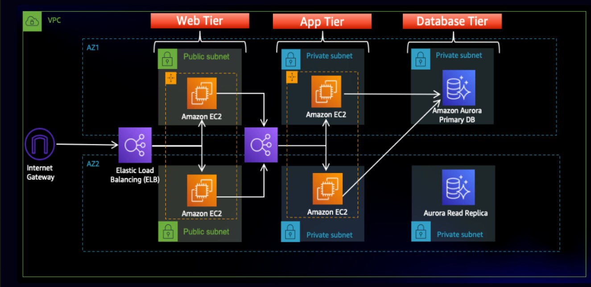
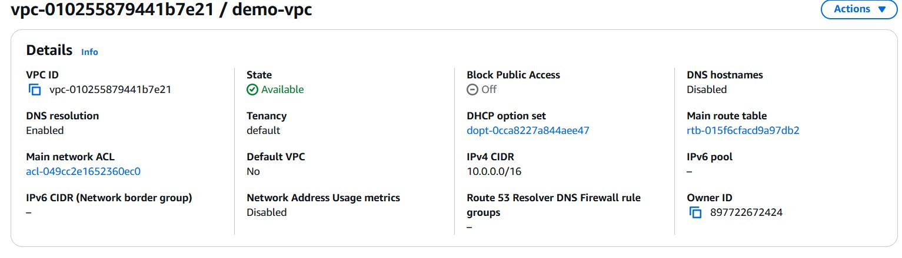
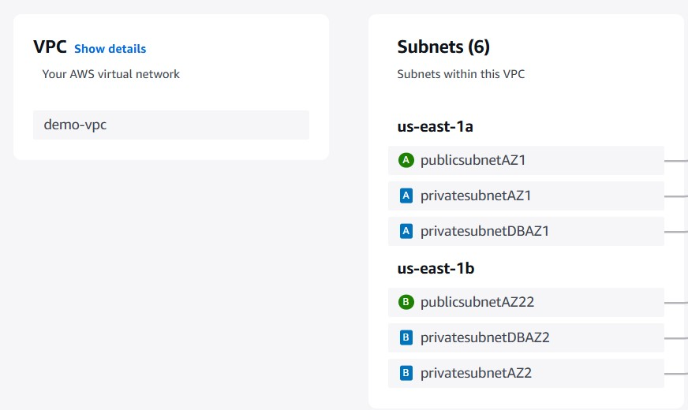
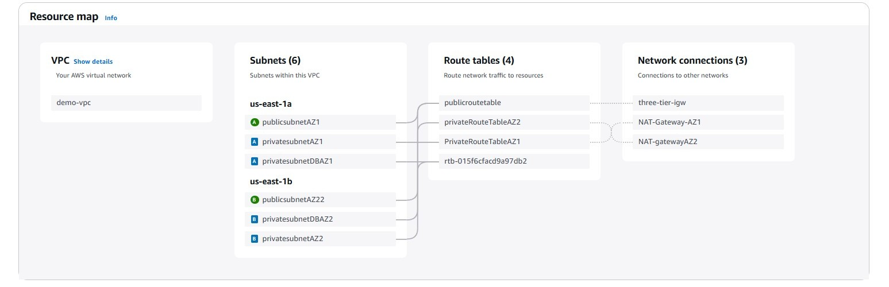
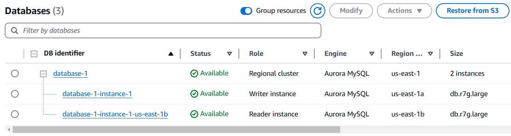
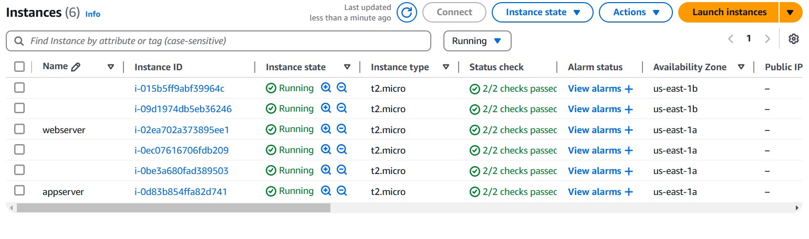
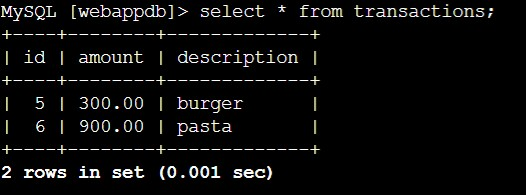

## 1. Project Overview
The objective of this project was to design, deploy, and configure a highly scalable and secure three-tier architecture on AWS. This architecture consists of a Web Tier, Application Tier, and Database Tier, ensuring modularity, security, and high availability. The deployment was performed using Amazon EC2, AWS Elastic Load Balancer (ELB), Amazon RDS, and Virtual Private Cloud (VPC).

## 2. Three tier architecture
- *Web Tier*
  - Amazon EC2 instances in a public subnet.
  - Elastic Load Balancer (ELB) to distribute traffic between EC2 instances.
  - Configured Security Groups to allow only HTTP/HTTPS traffic.
  
- *Application Tier*
  - Amazon EC2 instances deployed in a private subnet.
  - These instances process requests from the web tier and communicate with the database.
  - Security rules allow access only from the web tier.
  
- *Database Tier*
  - Amazon RDS (Aurora) deployed in a private subnet.
  - Configured read replicas for improved performance and reliability.
  - Security rules allow access only from the application tier.
    

## 3. Implementation Steps
### *1. Networking and Security* 
#### i.) Create a VPC. 

#### ii.) Create subnets.
Create 6 subnets across two availabilty zones (say us-east-1a and us-east-1b). Each availabity zone has 3 subnets- public, private and one more private for database.

#### iii.) Create a Internet gateway.
Create a Internet gateway and attach it to the vpc.

#### iv.) Create NAT gateways.
Create a 2 NAT gateway (for each availabilty zone) so that the instance with the private subnet has access to the internet through a secured channel. The subnet allocated would be the public ones.

#### v.) Create route tables.
Create a 3 route table (one for the public subnets in web layer and 2 for each private subnet in app layer).  

i.) *Public Route Table-* It is available through the internet everywhere. Routes are destinated to 0.0.0.0/24 and target is The Internet Gateway. Associate the Route Table to the 2 public subnets.  

ii.) *2 Private Route Table-* They are available through the internet everywhere. Routes are destinated to 0.0.0.0/24 and target is the NAT Gateway for . Associate the Route Table to the 2 public subnets.  

Networking Explained:

#### vi.) Create security groups.
Create the security groups for following purpusose allowing following inbound rules to grant access to the ports.

i.) *Internet Facing Security Group -* For the external load balancer. Allowing 2 inbound rules: access http. One allowing acess to ipv4 and another one to ipv6.  

ii.) *Web-Tier Security Group-*  Allowing 2 inbound rules: access http. One with source internet facing with source type custom and another with source type MyIP.  

iii.) *Internal load balancer Security Group -* Allowing http with the source Web-Tier Security Group.  

iv.) *Private instance Security Group -* Allowing 2 inbound rules: access to port 4000. One with source internal load balancer, source type custom and another is with source type MyIP.      

v.) *Database Security Group-*  Allowing acess to mysql/aurora with source private instance security group.

### *2. RDS database creation*  
i.) *Create a subnet group-* Create a subnet group using VPC and 2 private database subnets.   

ii.) *Create a database-* Create a database (used Amazon Aurora), providing it with master username and master password using the vpc and subnet group created. Used security group database security group we created.  

  

### *3. Create a s3 buckect*
i.) *Create a s3 bucket-* Create a s3 bucket and also a IAM role for the ec2 to access it. Upload the code files and folders to it.

### *4. Launching a private instance*
i.) *Launch a private instance-* This is instance is for app-tier. Configure it with the ami, key, networking with vpc, private subnet and private security group, IAM role created.  

ii.)*Install the pre-requisites-* Install mysql client and nvm packages along with npm required on the server.  

iii.)*Connect the database-* Connect the mysql to the RDS database created by providing it with the username, endpoint and the password.  

iv.)*Create the database and the table-* Create the database and use it to make a table with required columns.  

v.)*Copy the backend code-* Copied the backend web-tier code from s3 bucket.  

vi.)*Configure the pm2 service-* Enter the directory and configure the pm2 service by starting it, listing it, checking logs(if needed). Perform pm2 startup and provide the shell with the path and save it.  

vii.)*Test the connectivity-* Check the database connectivity by curling it on the provided port(here, 4000), performing health checks.

### *5. Creating a internal load balancer and auto-scaling group*   
i.) *Create a image-* Create a image using the app-tier instance.  

ii.) *Create a target group-* Create a target group, configure ports(here 4000), networking, health checks.  

iii.) *Create a Load Balancer-* Create a application load balancer. Configure it, keeping it internal, vpc, private subnets created in the avalabity zones, provide it with the necessary security group and listen it to the app-tier target group created.   

iv.) *Create a Launch Template-* Create a launch template using the AMI image. Configure it by providing instance type, security group, key, IAM role.  

v.) *Create a Auto-Scaling Group-* Create a Auto-Scaling using the Launch Template. Configure it by private subnet in availabity zone, vpc, desired and maximum capcity and other modifications as per the need and attach it to the load balancer and target group.  

Update the nginx.conf by providing the load balancer DNS name.  

### *6. Launching a public instance*
i.) *Launch a public instance-* This is instance is for web-tier. Configure it with the ami, key, networking with vpc, public subnet and public security group, allocating elastic IP, IAM role created.  

ii.)*Install the pre-requisites-* Install nvm packages on the server.   

iii.)*Copy the code-* Copied the backend app-tier code from s3 bucket.    

iv.)*Configure the npm service-* Enter the directory and install npm package and build it.Install nginx on the server and provide it access to the files.  

### *7. Creating a external load balancer and auto-scaling group*   
i.) *Create a image-* Create a image using the web-tier instance.  

ii.) *Create a target group-* Create a target group by configuring ports, networking, health checks.   

iii.) *Create a Load Balancer-* Create a application load balancer. Configure it by keeping it internet facing,vpc, public subnets created in the avalabity zones, provide it with the necessary security group and listen it to the web server target group created.  

iv.) *Create a Launch Template-* Create a launch template using the AMI image. Configure it by providing instance type, security group, key, IAM role.  

v.) *Create a Auto-Scaling Group-* Create a Auto-Scaling using the Launch Template. Configure it by public subnet in availabity zone, vpc, desired and maximum capcity and other modifications as per the need and attach it to the load balancer and target group.   

*All instances*  

 

## 4. Final Conclusion and Output  

Here's the final output of the project:

*Web-tier:*  

   

*App-tier insatnce:*  

 

*Conclusion*  

This project demonstrates expertise in AWS cloud architecture, networking, security, and deployment best practices. The three-tier architecture provides a robust framework for hosting scalable and secure applications, making it a valuable addition to cloud-based solutions.

 

## 1. Project Overview
The objective of this project was to design, deploy, and configure a highly scalable and secure three-tier architecture on AWS. This architecture consists of a Web Tier, Application Tier, and Database Tier, ensuring modularity, security, and high availability. The deployment was performed using Amazon EC2, AWS Elastic Load Balancer (ELB), Amazon RDS, and Virtual Private Cloud (VPC).

## 2. Three tier architecture
- *Web Tier*
  - Amazon EC2 instances in a public subnet.
  - Elastic Load Balancer (ELB) to distribute traffic between EC2 instances.
  - Configured Security Groups to allow only HTTP/HTTPS traffic.
  
- *Application Tier*
  - Amazon EC2 instances deployed in a private subnet.
  - These instances process requests from the web tier and communicate with the database.
  - Security rules allow access only from the web tier.
  
- *Database Tier*
  - Amazon RDS (Aurora) deployed in a private subnet.
  - Configured read replicas for improved performance and reliability.
  - Security rules allow access only from the application tier.
    

## 3. Implementation Steps
### *1. Networking and Security* 
#### i.) Create a VPC. 

#### ii.) Create subnets.
Create 6 subnets across two availabilty zones (say us-east-1a and us-east-1b). Each availabity zone has 3 subnets- public, private and one more private for database.

#### iii.) Create a Internet gateway.
Create a Internet gateway and attach it to the vpc.

#### iv.) Create NAT gateways.
Create a 2 NAT gateway (for each availabilty zone) so that the instance with the private subnet has access to the internet through a secured channel. The subnet allocated would be the public ones.

#### v.) Create route tables.
Create a 3 route table (one for the public subnets in web layer and 2 for each private subnet in app layer).  

i.) *Public Route Table-* It is available through the internet everywhere. Routes are destinated to 0.0.0.0/24 and target is The Internet Gateway. Associate the Route Table to the 2 public subnets.  

ii.) *2 Private Route Table-* They are available through the internet everywhere. Routes are destinated to 0.0.0.0/24 and target is the NAT Gateway for . Associate the Route Table to the 2 public subnets.  

Networking Explained:

#### vi.) Create security groups.
Create the security groups for following purpusose allowing following inbound rules to grant access to the ports.

i.) *Internet Facing Security Group -* For the external load balancer. Allowing 2 inbound rules: access http. One allowing acess to ipv4 and another one to ipv6.  

ii.) *Web-Tier Security Group-*  Allowing 2 inbound rules: access http. One with source internet facing with source type custom and another with source type MyIP.  

iii.) *Internal load balancer Security Group -* Allowing http with the source Web-Tier Security Group.  

iv.) *Private instance Security Group -* Allowing 2 inbound rules: access to port 4000. One with source internal load balancer, source type custom and another is with source type MyIP.      

v.) *Database Security Group-*  Allowing acess to mysql/aurora with source private instance security group.

### *2. RDS database creation*  
i.) *Create a subnet group-* Create a subnet group using VPC and 2 private database subnets.   

ii.) *Create a database-* Create a database (used Amazon Aurora), providing it with master username and master password using the vpc and subnet group created. Used security group database security group we created.  

  

### *3. Create a s3 buckect*
i.) *Create a s3 bucket-* Create a s3 bucket and also a IAM role for the ec2 to access it. Upload the code files and folders to it.

### *4. Launching a private instance*
i.) *Launch a private instance-* This is instance is for app-tier. Configure it with the ami, key, networking with vpc, private subnet and private security group, IAM role created.  

ii.)*Install the pre-requisites-* Install mysql client and nvm packages along with npm required on the server.  

iii.)*Connect the database-* Connect the mysql to the RDS database created by providing it with the username, endpoint and the password.  

iv.)*Create the database and the table-* Create the database and use it to make a table with required columns.  

v.)*Copy the backend code-* Copied the backend web-tier code from s3 bucket.  

vi.)*Configure the pm2 service-* Enter the directory and configure the pm2 service by starting it, listing it, checking logs(if needed). Perform pm2 startup and provide the shell with the path and save it.  

vii.)*Test the connectivity-* Check the database connectivity by curling it on the provided port(here, 4000), performing health checks.

### *5. Creating a internal load balancer and auto-scaling group*   
i.) *Create a image-* Create a image using the app-tier instance.  

ii.) *Create a target group-* Create a target group, configure ports(here 4000), networking, health checks.  

iii.) *Create a Load Balancer-* Create a application load balancer. Configure it, keeping it internal, vpc, private subnets created in the avalabity zones, provide it with the necessary security group and listen it to the app-tier target group created.   

iv.) *Create a Launch Template-* Create a launch template using the AMI image. Configure it by providing instance type, security group, key, IAM role.  

v.) *Create a Auto-Scaling Group-* Create a Auto-Scaling using the Launch Template. Configure it by private subnet in availabity zone, vpc, desired and maximum capcity and other modifications as per the need and attach it to the load balancer and target group.  

Update the nginx.conf by providing the load balancer DNS name.  

### *6. Launching a public instance*
i.) *Launch a public instance-* This is instance is for web-tier. Configure it with the ami, key, networking with vpc, public subnet and public security group, allocating elastic IP, IAM role created.  

ii.)*Install the pre-requisites-* Install nvm packages on the server.   

iii.)*Copy the code-* Copied the backend app-tier code from s3 bucket.    

iv.)*Configure the npm service-* Enter the directory and install npm package and build it.Install nginx on the server and provide it access to the files.  

### *7. Creating a external load balancer and auto-scaling group*   
i.) *Create a image-* Create a image using the web-tier instance.  

ii.) *Create a target group-* Create a target group by configuring ports, networking, health checks.   

iii.) *Create a Load Balancer-* Create a application load balancer. Configure it by keeping it internet facing,vpc, public subnets created in the avalabity zones, provide it with the necessary security group and listen it to the web server target group created.  

iv.) *Create a Launch Template-* Create a launch template using the AMI image. Configure it by providing instance type, security group, key, IAM role.  

v.) *Create a Auto-Scaling Group-* Create a Auto-Scaling using the Launch Template. Configure it by public subnet in availabity zone, vpc, desired and maximum capcity and other modifications as per the need and attach it to the load balancer and target group.   

*All instances*  

 

## 4. Final Conclusion and Output  

Here's the final output of the project:

*Web-tier:*  

   

*App-tier insatnce:*  

 

*Conclusion*  

This project demonstrates expertise in AWS cloud architecture, networking, security, and deployment best practices. The three-tier architecture provides a robust framework for hosting scalable and secure applications, making it a valuable addition to cloud-based solutions.